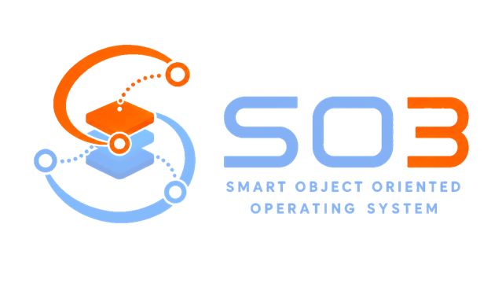

  

# Welcome to SO3 — the Smart Object Oriented (SOO) Operating System

SO3 is a compact, lightweight, full-featured and extensible operating system,
particularly well suited to embedded and IoT systems. It is the result of
several years of research and development at the REDS Institute of HEIG-VD, has
long been used as a teaching platform, and today forms the foundation of the
**SOO** framework.

## A polymorphic operating system

The most distinctive feature of SO3 is that it is **polymorphic**: from a
**single source tree**, the very same code base can be configured and built into
three different kinds of system.

- **Standalone OS** — SO3 runs directly on the hardware as a conventional
  monolithic OS (kernel at **EL1**, user applications at **EL0** on ARM64). This
  is the configuration used for teaching and for plain embedded products.
- **AVZ hypervisor** — built with `CONFIG_AVZ`, the same tree becomes **AVZ**
  (*Agency VirtualiZer*), a lightweight type-1 hypervisor running at **EL2** that
  hosts one or more guest *domains* — the primary guest being the *agency*.
- **SO3 capsule (S3C)** — on top of AVZ, the **SOO** framework adds *SO3
  capsules*: lightweight, self-contained guests running at EL1 beside a Linux
  *agency* and cooperating with it through split (frontend/backend) drivers. The
  capsule (guest) side lives in this repository; the Linux agency and the rest
  of the SOO framework live in a separate one.

SO3 targets ARM 32-bit and 64-bit, is multicore, and is kept *as compact as
possible*. It ships with a MUSL-based user space and integrations such as LVGL,
lwIP and MicroPython.

## Documentation

The complete and up-to-date documentation — philosophy, architecture, build
system, user guide, debugging and more — is the source of truth. It lives in
[`doc/`](doc/) and is published at:

### 👉 https://smartobjectoriented.github.io/so3

Start there for everything about building, configuring, running and debugging
SO3.

## Supported targets

- QEMU `virt` — ARM 32-bit and 64-bit
- Raspberry Pi 4 (64-bit)
- Toradex Verdin iMX8M Plus

## Contributing

The `main` branch is the development line for the next version.

> [!IMPORTANT]
> Do not push directly to `main`. Each development is tracked by an issue with
> its own branch; open a merge/pull request as soon as it is stable enough for
> review.

If you would like to contribute, please first get in touch with the maintainer at
[daniel.rossier@heig-vd.ch](mailto:daniel.rossier@heig-vd.ch).

## Releases

SO3 uses a branch-per-release model: development happens on `main`, and every
minor version gets a long-lived `release/vX.Y` maintenance branch on which patch
releases are tagged (`vX.Y.Z`, or `vX.Y.Z-rc` for candidates). Each tag has a
matching [GitHub Release](https://github.com/smartobjectoriented/so3/releases).

The full procedure — cutting patch and minor releases, tagging and publishing —
is documented in
[Release process](https://smartobjectoriented.github.io/so3/release_process.html).

### Maintenance branches

Each minor line has its own long-lived branch. Bug fixes for a published version
land there and are tagged as patch releases.

| Line | Branch | Latest release | Status |
|------|--------|----------------|--------|
| 6.2  | [`release/v6.2`](https://github.com/smartobjectoriented/so3/tree/release/v6.2) | [v6.2.5](https://github.com/smartobjectoriented/so3/releases/tag/v6.2.5) | Current stable |
| 6.1  | [`release/v6.1`](https://github.com/smartobjectoriented/so3/tree/release/v6.1) | [v6.1.0](https://github.com/smartobjectoriented/so3/releases/tag/v6.1.0) | Previous |
| 5.4  | [`release/v5.4`](https://github.com/smartobjectoriented/so3/tree/release/v5.4) | [v5.4.1](https://github.com/smartobjectoriented/so3/releases/tag/v5.4.1) | End of life |

See all versions on the
[Releases page](https://github.com/smartobjectoriented/so3/releases).

## Credits

We warmly thank our sponsors for their generous support in funding the
development of the SO3 ecosystem, in particular
[HEIG-VD](https://www.heig-vd.ch) and the
[Hasler Foundation](https://haslerstiftung.ch/en/welcome-to-the-hasler-foundation).

We are also grateful to all the contributors — developers, students, researchers
and community members alike — whose code, ideas and feedback have shaped SO3.

## License

SO3 is released under the [GNU General Public License v2](LICENSE).
