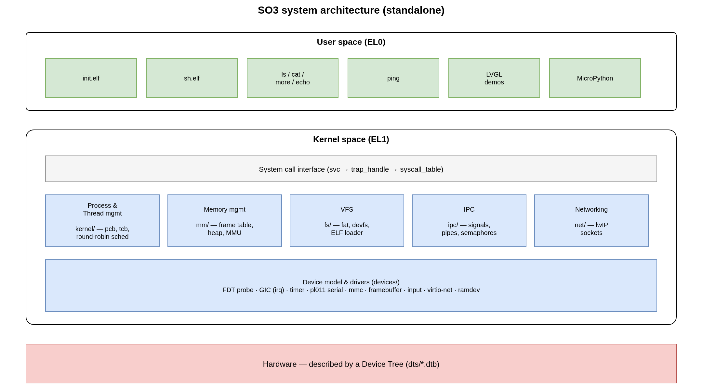
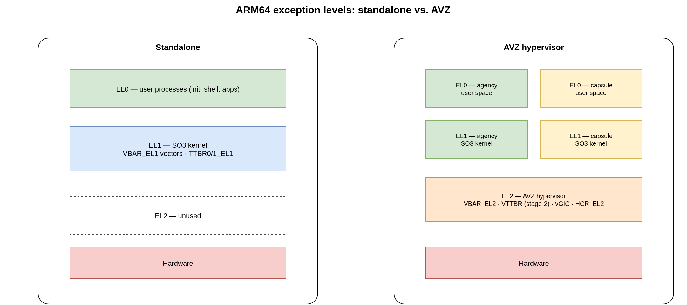
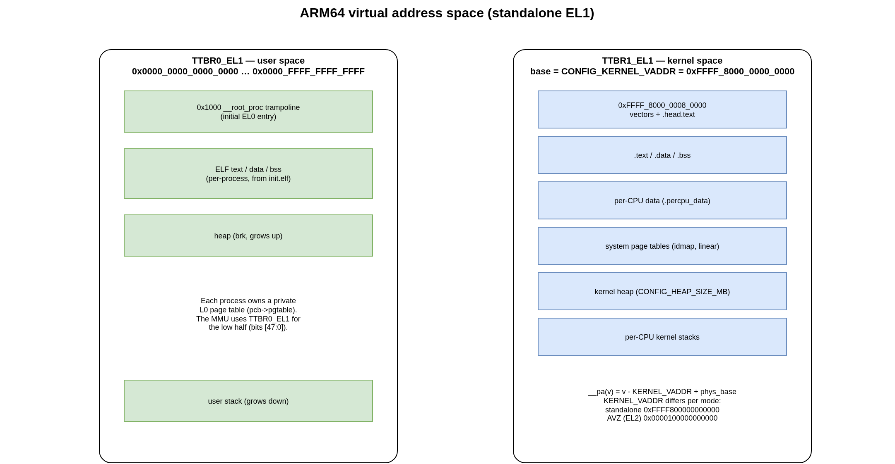
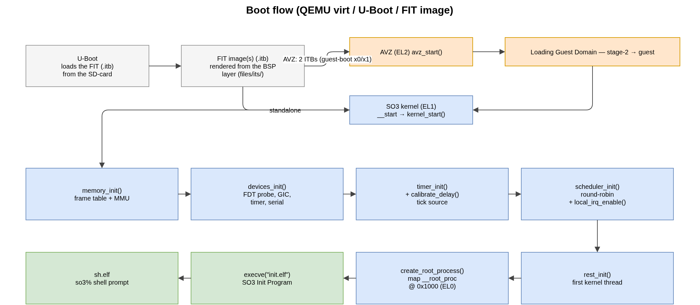

.. _architecture:

SO3 Architecture
################

SO3 follows a conventional operating-system organisation with a **user space**
and a **kernel space**. It is a *monolithic* kernel, like Linux: all subsystems
and device drivers live in the kernel.

   Overview of the SO3 environment (standalone configuration).

The user space is a small set of lightweight applications (``init``, the shell,
``ls``, ``cat``, ``more``, ``ping``, …) built against the **MUSL** C library and
stored in a root filesystem. The kernel provides the usual subsystems —
process/thread management and scheduling, memory management, a virtual
filesystem, IPC, networking — plus a device-tree-driven device and driver model.

Source tree
===========

The kernel source lives under ``so3/`` and is organised by subsystem::

   so3/
   ├── arch/         # architecture-specific code (arm32, arm64)
   │   └── arm64/    #   head/boot, exceptions, MMU, context switch, traps
   ├── kernel/       # processes, threads, scheduler, syscalls, time
   ├── mm/           # page frame allocator, kernel heap
   ├── fs/           # VFS, FAT, devfs, ELF loader
   ├── ipc/          # signals, pipes, semaphores, completions
   ├── net/          # networking, lwIP TCP/IP stack
   ├── devices/      # device model + drivers (irq, timer, serial, mmc, fb, …)
   ├── dts/          # device trees (*.dts → *.dtb)
   ├── avz/          # the AVZ hypervisor (built with CONFIG_AVZ)
   ├── soo/          # the SOO framework / SO3 capsules (CONFIG_SOO)
   ├── configs/      # defconfig files
   └── lib/          # in-kernel helper libraries (libfdt, libroxml, …)

The user space lives under ``usr/`` and the surrounding tooling (bootloader,
emulator, root filesystem, deployment scripts) at the repository root — see
:ref:`build_system` and :ref:`user_space`.

Exception levels
================

On ARM64, SO3 uses the architectural exception levels as follows.

   Exception levels in the standalone and AVZ configurations.

* **Standalone** — user processes run at **EL0**, the SO3 kernel at **EL1**.
  EL2 is unused. The kernel owns ``VBAR_EL1`` (exception vectors) and the
  ``TTBR0_EL1`` / ``TTBR1_EL1`` translation tables.
* **AVZ** — the **AVZ hypervisor** runs at **EL2** (``VBAR_EL2``, stage-2
  translation via ``VTTBR_EL2``, ``HCR_EL2`` configured to trap and inject
  interrupts). Each guest (the agency and any capsule) runs its own SO3 kernel
  at EL1 with its user space at EL0, isolated by per-domain stage-2 tables.

The exact level a given build targets is selected by ``CONFIG_AVZ``. The same
C and assembly files implement both; EL2-specific code is guarded with
``#ifdef CONFIG_AVZ`` (for example the TLB-maintenance instructions in
``arch/arm64/cache.S`` and the vector handlers in ``arch/arm64/exception.S``).

Virtual address space
=====================

Each process owns a private set of page tables. On ARM64 the low half of the
address space (``TTBR0_EL1``) maps the current user process, and the high half
(``TTBR1_EL1``) maps the kernel.

   ARM64 virtual address space (standalone, EL1).

The kernel base address is configured by ``CONFIG_KERNEL_VADDR``:

.. flat-table::
   :header-rows: 1
   :widths: 30 40 30

   * - Configuration
     - ``CONFIG_KERNEL_VADDR``
     - Notes
   * - standalone (EL1)
     - ``0xFFFF800000000000``
     - kernel in the high (TTBR1) half
   * - AVZ (EL2)
     - ``0x0000100000000000``
     - hypervisor address space

The ``__pa()`` / ``__va()`` macros (``include/memory.h``) translate between
kernel virtual addresses and physical addresses using ``CONFIG_KERNEL_VADDR``
and the physical RAM base discovered from the device tree. The initial user
program is mapped at ``USER_SPACE_VADDR`` (``0x1000``). See :ref:`kernel` for
the page-frame allocator and the MMU code.

Boot flow
=========

SO3 is started by **U-Boot**, which loads a **FIT image** (``.itb``) containing
the kernel, the device-tree blob and the root filesystem. In the AVZ
configuration U-Boot loads the hypervisor and the agency guest as **two separate
ITBs** — the AVZ ITB (``<plat>_avz``) and the SO3 guest ITB
(``<plat>_so3_guest``) — on every AVZ platform (``virt64``, ``rpi4_64``,
``verdin_imx8mp``); see :ref:`build_system`.

   Boot flow from U-Boot to the interactive shell.

1. **U-Boot** loads the FIT image(s) from the boot medium and jumps to the entry
   point of the first component. In the ``virt64`` two-ITB AVZ boot it loads both
   the AVZ and guest ITBs and enters AVZ through the ``e1c-boot`` command, which
   passes the AVZ FIT in ``x0`` and the guest ITB in ``x1``.
2. In the **AVZ** configuration, control enters the hypervisor
   (``avz_start()`` at EL2); AVZ sets up the stage-2 tables, *loads the guest
   domain* and ``eret``\ s into the agency at EL1. In the **standalone**
   configuration U-Boot jumps straight to the SO3 kernel entry
   (``__start`` → ``kernel_start()``) at EL1.
3. The kernel brings itself up: ``memory_init()`` (frame table + MMU),
   ``devices_init()`` (device-tree probe, GIC, timer, serial), ``timer_init()``
   and ``calibrate_delay()``, ``scheduler_init()``, then interrupts are enabled.
4. ``rest_init()`` runs as the first kernel thread and calls
   ``create_root_process()``, which maps the ``__root_proc`` trampoline at
   ``0x1000`` and enters EL0.
5. The root process ``execve()``\ s ``init.elf`` (the *SO3 Init Program*), which
   in turn launches the shell (``sh.elf``) — the familiar ``so3%`` prompt.

The individual steps are described in :ref:`kernel`; the packaging of the FIT
image and the U-Boot/QEMU setup are covered in :ref:`build_system` and
:ref:`user_guide`.
