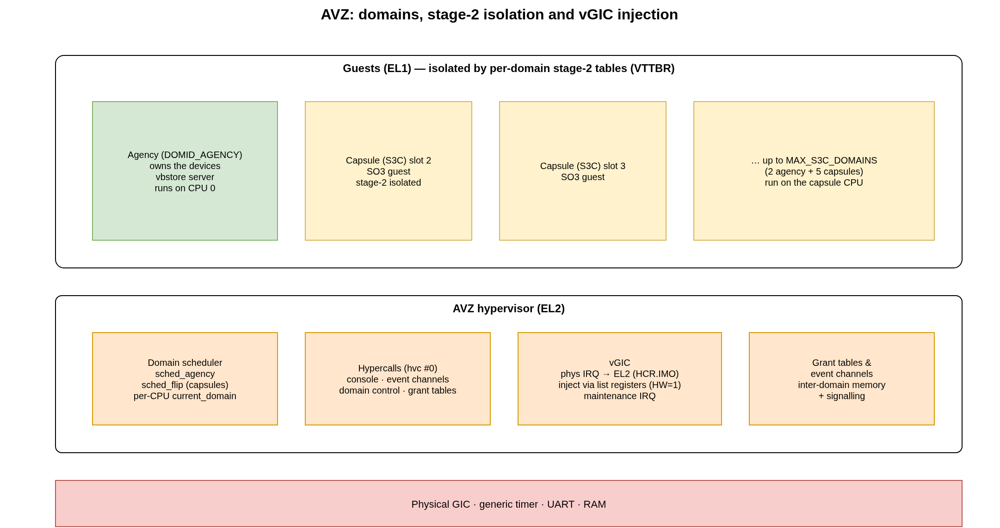

.. _avz:

AVZ Hypervisor
##############

**AVZ** (*Agency VirtualiZer*) is the type-1 hypervisor that ships inside the
SO3 tree. Built with ``CONFIG_AVZ``, the very same code base runs at **EL2** on
ARM64 and hosts guest *domains* at EL1. AVZ is small and Xen-inspired: it
provides stage-2 memory isolation, a domain scheduler, hypercalls, event
channels, grant tables and a virtual GIC, and nothing more.

AVZ is also the foundation of the :ref:`SO3 capsule <capsules>` model: an agency
domain owns the hardware while one or more lightweight capsule (S3C) guests run
beside it.

.. note::

   In the demonstration shipped with this repository the agency is an **SO3**
   kernel (enough to exercise the hypervisor). The full SO3 Capsule setup uses a
   **Linux** agency, which — together with the SOO framework — lives in a
   :ref:`separate repository <capsules>`.

   AVZ: domains isolated by stage-2 tables, and the EL2 services beneath them.

The code lives under ``so3/avz/`` (kernel, memory, scheduler, hypercalls, grant
tables, capsule build/inject) together with the EL2-specific parts of
``arch/arm64`` (``head.S`` MMU setup, ``exception.S`` EL2 vectors,
``context.S`` stage-2 switch, ``cache.S`` EL2 TLB ops) and the virtual GIC in
``devices/irq/``.

Boot and guest loading
======================

The hypervisor entry point is ``avz_start()`` (``avz/kernel/setup.c``). After
early CPU, memory and device initialisation it prints its banner and *loads the
guest domain*. U-Boot's ``e1c-boot`` command hands AVZ **two** FIT images — the
AVZ ITB in ``x0`` and a separate SO3 guest ITB in ``x1`` (see
:ref:`build_system`) — and ``loadAgency()`` parses the guest from the ``x1``
ITB. AVZ places the agency's kernel and device tree in RAM,
injects the guest initrd (the ITB ``ramdisk`` node) into the guest's
``/chosen``, builds the agency's **stage-2** page tables and sets the guest entry
point. AVZ then ``eret``\ s to EL1, and the agency boots as an ordinary SO3
kernel (``kernel_start()``). The console trace looks like::

   ********** Smart Object Oriented technology - AVZ Hypervisor **********
   ...
   Now bootstraping the hypervisor kernel ...
   ***************** Loading Guest Domain *****************
   ...
   ********** Smart Object Oriented SO3 Operating System **********

Guest memory is organised in **memory slots** (``avz/include/avz/memslot.h``):
slot 0 is AVZ itself, slot 1 the agency, and the remaining slots are capsules.
Each slot maps a guest *intermediate physical address* (IPA) range to real
physical memory; ``ipa_to_pa()`` / ``pa_to_ipa()`` convert between them.

Domains
=======

A **domain** (``struct domain``, ``avz/include/avz/domain.h``) is a guest
instance: its virtual CPU state, its event-channel table, a pointer to the
shared info page and its scheduling metadata. Well-known identifiers
(``avz/include/avz/uapi/avz.h``):

.. flat-table::
   :header-rows: 1
   :widths: 35 65

   * - Identifier
     - Meaning
   * - ``DOMID_AGENCY`` (0)
     - the primary agency guest (owns the devices)
   * - ``DOMID_AGENCY_RT`` (1)
     - optional real-time agency subdomain
   * - slots 2 …
     - capsule domains
   * - ``MAX_CAPSULE_DOMAINS``
     - ``2 + 5`` — up to five capsules alongside the agencies

Each domain shares a page with the hypervisor — the ``avz_shared`` structure —
carrying its domain id, event-channel pending bits, the upcall state and the
guest's device-tree address.

Hypercalls
==========

Guests call into AVZ with the ``hvc`` instruction, which traps to the EL2
synchronous handler (``el12_sync_handler`` in ``arch/arm64/exception.S``) and is
dispatched by ``avz/kernel/hypercalls.c``. The generic hypercalls
(``avz/include/avz/uapi/avz.h``) are:

* ``AVZ_EVENT_CHANNEL_OP`` — allocate / bind / send / close event channels;
* ``AVZ_CONSOLE_IO_OP`` — console output for guests;
* ``AVZ_DOMAIN_CONTROL_OP`` — domain control (pause / unpause a capsule, …).

The capsule-management operations (inject, kill, read/write snapshot) used by the
SOO framework are built on top of these — see :ref:`capsules`.

Domain scheduling
=================

AVZ runs each domain on a CPU according to its role. The agency uses the
``sched_agency`` policy; capsules are scheduled by ``sched_flip``
(``avz/kernel/sched_flip.c``), a lightweight round-robin over the capsule
domains. A per-CPU ``current_domain`` pointer tracks the running guest; switching
domains saves and restores the EL1 register banks and reprograms ``VTTBR_EL2``
through ``__mmu_switch_vttbr()`` (``arch/arm64/context.S``).

Inter-domain communication
==========================

Event channels
--------------

Each domain has ``NR_EVTCHN`` (128) event-channel ports. A port can be
*unbound* (waiting for a peer), *interdomain* (bound to a remote domain's port)
or bound to a *virtual IRQ*. Sending an event sets a pending bit in the remote
domain's ``avz_shared`` page and, if needed, injects a virtual interrupt so the
guest is woken. Event channels are the signalling half of the split-driver
model.

Grant tables
------------

Grant tables (``avz/kernel/gnttab.c``) let one domain share specific memory
pages with another in a controlled way. A domain reserves a small set of grant
IPA pages; a peer maps a granted page by reference. This is how the shared rings
of the frontend/backend drivers and the capsule framebuffer are set up.

Virtual GIC
===========

Because guests must not touch the physical interrupt controller directly, AVZ
provides a **virtual GIC**.

* ``HCR_EL2.IMO`` routes all Group-1 physical IRQs to **EL2**. The EL2 IRQ
  handler (``avz_el2_irq_handle()`` for GICv3, ``irq_handle()`` for GICv2)
  decides what to do with each interrupt.
* The hypervisor's own interrupts — the EL2 timer (CNTHP, PPI 26) and the vGIC
  **maintenance** interrupt (PPI 25) — are handled locally.
* All other interrupts destined for a guest are **injected** through the GIC
  *list registers* (``ICH_LR*_EL2`` on GICv3, the GICH MMIO frame on GICv2). The
  injected entry is *hardware-backed* (``HW = 1``) so that the physical
  interrupt is deactivated automatically when the guest writes its own
  end-of-interrupt — keeping hypervisor overhead minimal.
* Accesses by a guest to the physical GIC **distributor** are not mapped in the
  guest stage-2 tables; they trap to EL2 and are emulated by the vGIC
  (``devices/irq/vgic.c``), which forwards most register accesses and translates
  SGI (software-generated interrupt) requests into AVZ's targeted-IPI helper.

EL2 vs EL1 in the shared code
=============================

Because the standalone and AVZ builds share the same files, a handful of
low-level operations differ by exception level and are guarded with
``#ifdef CONFIG_AVZ``:

.. flat-table::
   :header-rows: 1
   :widths: 30 35 35

   * - Operation
     - Standalone (EL1)
     - AVZ (EL2)
   * - TLB maintenance (``cache.S``)
     - ``tlbi vmalle1`` / ``vae1is``
     - ``tlbi alle2`` / ``vae2is``
   * - MMU setup (``head.S``)
     - ``ttbr0/1_el1``, ``sctlr_el1``
     - ``ttbr0_el2``, ``tcr_el2``, ``sctlr_el2``
   * - GIC CPU interface
     - ``EOImode = 0``
     - ``EOImode = 1`` (split priority-drop / deactivate)
   * - sync/IRQ vectors (``exception.S``)
     - ``el01_sync`` / ``el01_1_irq``
     - ``el12_sync`` / ``el12_2_irq``

Getting these guards right is essential: an EL2-only instruction executed at EL1
(or vice versa) faults immediately at boot. See :ref:`debugging` for how such
issues are diagnosed under QEMU/GDB.
