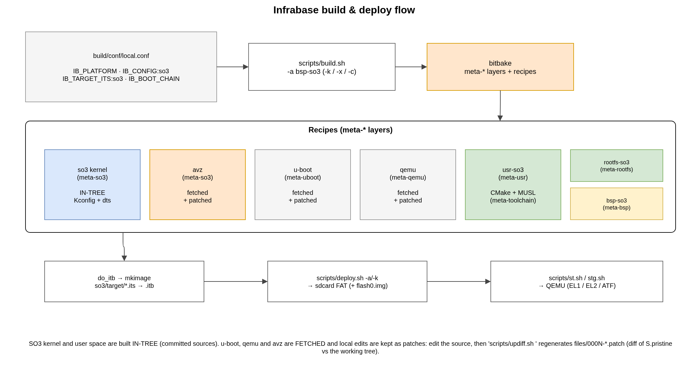

.. _build_system:

Build System
############

SO3 is built with **Infrabase**, a thin orchestration layer on top of
`bitbake <https://docs.yoctoproject.org/bitbake/>`__. A set of *meta-layers*
(``build/meta*``) provides the recipes; a single configuration file
(``build/conf/local.conf``) selects *what* to build; and a handful of wrapper
scripts in ``scripts/`` drive the whole thing — building the kernel, the user
space, U-Boot, the root filesystem and the FIT image, then packaging them onto a
virtual SD-card.

   From ``local.conf`` through the meta-layer recipes to a bootable image.

The SO3 **kernel** and **user space** are built *in tree* (directly from the
committed ``so3/`` sources). The other components — **U-Boot**, **QEMU**, the
**AVZ** hypervisor and (optionally) **ARM-TF/OP-TEE** — are *fetched* from
upstream and local changes are kept as patches (see
:ref:`fetched components <fetched_components>`).

Prerequisites
=============

Infrabase drives bitbake, so the **host** needs the usual Yocto/bitbake build
dependencies plus the SO3 image tooling (``device-tree-compiler``,
``u-boot-tools``, ``mtools``, ``dosfstools``, ``rsync``, ``parted``, the QEMU
build dependencies, …) and a few **cross-toolchains** that are *not* built by the
layers. The canonical, continuously-tested list is the base container recipe
``docker/Dockerfile.toolchains`` — mirror it when setting up a bare host.
For development, the same environment is available as a ready-made build
container: ``scripts/dbuild.sh --build`` then ``scripts/dbuild.sh build.sh
bsp-linux`` (or bare ``dbuild.sh`` for a shell) runs any front-end script
inside it, with the repository bind-mounted at its own path and the container
running as the calling user — see ``docker/README.md``.

The cross-toolchains that must be on ``PATH``:

.. flat-table::
   :header-rows: 1
   :widths: 30 34 36

   * - Used for
     - Toolchain (prefix)
     - Selected by
   * - **Kernel** (and AVZ), bare-metal
     - ``aarch64-none-elf-`` (64-bit) / ``arm-none-eabi-`` (32-bit)
     - ``CONFIG_CROSS_COMPILE`` in the kernel defconfig
   * - **U-Boot**, GNU/Linux
     - ``aarch64-none-linux-gnu-`` (virt64/rpi4_64) / ``arm-linux-gnueabihf-`` (virt32)
     - ``IB_TOOLCHAIN`` in ``local.conf``
   * - **User space**, MUSL
     - ``aarch64-linux-musl`` / ``arm-linux-musleabihf``
     - built automatically by ``meta-toolchain`` — *no action*

.. note::

   The MUSL user-space toolchains are produced into the bitbake work tree by the
   ``meta-toolchain`` layer; there is no manual step for them. Only the bare-metal
   (kernel/AVZ) and GNU/Linux (U-Boot) toolchains must be installed on the host.

To avoid installing anything on the host, build inside the container instead —
see :ref:`Running with Docker <user_guide>`.

Getting started
===============

Everything is anchored on the repository root. Source ``env.sh`` once per shell:

.. code-block:: bash

   source env.sh

This exports ``IB_ROOT_DIR``, sets ``BBPATH``/``BUILDDIR`` to ``build/``, and
prepends ``scripts/`` and the bundled ``bitbake`` to ``PATH`` so the active tree
wins. From then on the ``build.sh`` / ``deploy.sh`` / ``st.sh`` commands are on
the path. See :ref:`user_guide` for the end-to-end walkthrough.

Meta-layers
===========

.. flat-table::
   :header-rows: 1
   :widths: 24 76

   * - Layer
     - Provides
   * - ``meta``
     - base bitbake classes — notably ``patch.bbclass`` (the fetch/patch/``updiff``
       machinery) and the privileged-helper plumbing.
   * - ``meta-so3``
     - the **SO3 kernel** recipe (``so3_<version>.bb``, built in tree) and the
       **AVZ** hypervisor recipe (``avz_<version>.bb``); both are named after the
       current release and pinned by ``PREFERRED_VERSION_*`` (see
       :ref:`release_process`).
   * - ``meta-usr``
     - the **user space** (``usr-so3``, CMake + MUSL toolchain): a committed
       lvgl-free base, plus opt-in add-ons layered as patches via overrides —
       ``:lvgl`` (LVGL + ``slv`` + demos) and ``:soo`` (capsule user space).
   * - ``meta-bsp``
     - **board support**: ``bsp-so3`` assembles the FIT image (``do_itb``) and
       writes the boot media (``do_deploy_boot``); ``bsp-linux`` does the same for
       the Linux agency and ``bsp-capsules`` for an agency running SO3 capsules
       (see :ref:`capsules`).
   * - ``meta-uboot``
     - the **U-Boot** bootloader (fetched + patched).
   * - ``meta-qemu``
     - the patched **QEMU** emulator (the ``virt`` machine with PL111/PL050/
       absmouse — see :ref:`display_input`).
   * - ``meta-linux``
     - the **Linux** kernel recipe (fetched from kernel.org + patched), plus the
       opt-in ``soo`` override that builds Linux as the capsule **agency**
       (see :ref:`capsules`).
   * - ``meta-rootfs``
     - builds the **root filesystem** image (``rootfs.fat``).
   * - ``meta-toolchain``
     - builds the **MUSL** cross-toolchains used by the user space.
   * - ``meta-atf``
     - **ARM Trusted Firmware** and **OP-TEE** (only for the secure boot chains).
   * - ``meta-filesystem``
     - creates and populates the **SD-card image** (privileged ``losetup``/
       ``mkfs``/``mount`` via ``sudo -n``).

``build/conf/bblayers.conf`` is regenerated automatically from this fixed list;
do not edit it by hand.

Configuration — ``build/conf/local.conf``
=========================================

A few ``IB_*`` variables select the target and the deployment mode:

.. flat-table::
   :header-rows: 1
   :widths: 30 70

   * - Variable
     - Meaning
   * - ``IB_PLATFORM``
     - target platform: ``virt64`` (default), ``virt32``, ``rpi4_64``, …
   * - ``IB_CONFIG:so3:<plat>``
     - the SO3 kernel ``defconfig`` (e.g. ``virt32_fb_defconfig``).
   * - ``IB_TARGET_ITS:so3:<plat>``
     - the **FIT image** to assemble — this is what selects the *deployment mode*.
   * - ``IB_BOOT_CHAIN``
     - the firmware chain: ``""``/``uboot`` (bare U-Boot), ``atf+uboot`` (ARM-TF),
       or ``full`` (ARM-TF + OP-TEE).
   * - ``IB_ATF_PLAT`` / ``IB_OPTEE_PLAT`` / ``IB_ATF_EXTRA_OPTS``
     - ARM-TF / OP-TEE platform identifiers and build options (secure chains only).

The same ``virt64`` kernel can be deployed three ways purely by choosing the ITS,
without a per-platform ``IB_PLATFORM:so3`` override:

.. flat-table::
   :header-rows: 1
   :widths: 34 66

   * - ``IB_TARGET_ITS:so3:virt64``
     - Deployment
   * - ``virt64_so3``
     - SO3 **standalone** (kernel at EL1)
   * - ``virt64_avz``
     - SO3 as a plain **AVZ guest** (AVZ at EL2, ``CONFIG_SOO=n``, see :ref:`avz`)
   * - ``virt64_capsule``
     - an SO3 **capsule** (see :ref:`capsules`)

``IB_BOOT_CHAIN`` is a *weak* assignment so a capsule deployment can override it.
For the QEMU ``virt`` machine, ``""``/``uboot`` boots a bare U-Boot, ``atf+uboot``
boots through ARM-TF (EL3 → EL2), and ``full`` additionally loads OP-TEE.

.. note::

   Those three ITS targets build **SO3** only. The same tree can also build
   **Linux as the capsule agency**: enable the ``soo`` override
   (``EXTRA_OVERRIDES .= ":soo"``) and pick a SOO Linux config
   (``IB_CONFIG:linux:<plat> = "virt64_soo_defconfig"``). The ``meta-linux``
   ``soo`` layer then fetches and patches Linux into the agency, and the
   ``bsp-capsules`` recipe deploys it beside the capsules — see :ref:`capsules`.

The build & deploy scripts
==========================

``build.sh`` runs bitbake to *build* artefacts:

.. flat-table::
   :header-rows: 1
   :widths: 18 82

   * - Option
     - Action
   * - ``<recipe>`` (or ``-x <recipe>``)
     - build a recipe and its dependency tree. A **BSP** name (``bsp-so3``,
       ``bsp-linux``) pulls everything (kernel + U-Boot + rootfs + FIT); a
       **component** (``usr-so3``, ``qemu``, ``avz``, ``so3``, ``uboot``,
       ``filesystem``, …) builds just itself. ``-x`` is optional — the recipe
       may be a bare argument. Opens the ``sudo -n`` session automatically for
       recipes that need root at build time (``filesystem``, ``bsp-linux``).
   * - ``-c``
     - **clean** the recipe first, then rebuild.
   * - ``-l`` / ``-v``
     - **list** all recipes / **verbose** bitbake output.

``deploy.sh`` then *writes the boot media* (and opens the ``sudo -n``
session the privileged tasks need): ``deploy.sh <recipe>`` (``-x`` optional)
deploys it — a BSP writes the whole image (rootfs → p2 + FIT/ITB → p1), a
component (e.g. ``usr-so3``) deploys just its part. ``-l`` / ``-v`` list /
verbose. Deploy does **not** recompile: it consumes what ``build.sh`` already
produced (``rootfs.cpio``, the FIT), so the workflow is *edit → build.sh →
deploy.sh*. A deploy with no prior build fails clearly rather than silently
rebuilding.

.. important::

   ``build.sh bsp-so3`` compiles the BSP but does **not** create the SD-card
   image itself: the empty ``filesystem/sdcard.img.<platform>`` is produced by the
   separate, privileged ``filesystem`` recipe (``losetup``/``mkfs``/``parted``).
   ``deploy.sh`` populates and writes that image but does not create it, so a
   deploy against a fresh tree fails until the image exists. The canonical
   first-build sequence is therefore three steps::

      build.sh bsp-so3        # compile kernel + user space + U-Boot + rootfs + FIT
      build.sh -x filesystem  # create + format the SD-card image (privileged, once)
      deploy.sh bsp-so3       # populate the rootfs and write the boot media

   Once the image exists, later edits only need ``build.sh -x <recipe>`` +
   ``deploy.sh bsp-so3`` — the ``filesystem`` step is a one-off.

.. note::

   ``build.sh`` / ``deploy.sh`` take the recipe as a **positional argument**
   (``-x`` is accepted but optional); ``-l`` lists every recipe. A BSP name
   builds/deploys the whole BSP, a component name just that recipe — the former
   ``-a`` / ``-k`` / ``-b`` / ``-r`` / ``-f`` flags are gone.

.. important::

   The SO3 kernel is built *in tree*, and bitbake does not track the in-tree
   ``so3/so3/so3.bin`` as a task output. After rebuilding the kernel
   (``build.sh -x so3``), run ``deploy.sh bsp-so3`` to regenerate the FIT
   image and refresh the SD-card — otherwise you boot the *previous* kernel.

The SO3 kernel recipe
=====================

``so3_<version>.bb`` configures and builds the kernel straight from ``so3/so3``;
the mechanics below are the still-familiar Kbuild ones.

Configuration (Kconfig)
-----------------------

Each subsystem carries a ``Kconfig``; every option becomes a ``CONFIG_*`` symbol
stored in ``so3/so3/.config`` and exposed as
``include/generated/autoconf.h``. ``IB_CONFIG:so3:<plat>`` names the
``defconfig`` (``so3/so3/configs/``) the recipe loads. The target architecture
(``CONFIG_VIRT64``/``CONFIG_RPI4_64``/``CONFIG_VIRT32``…) and the mode
(``CONFIG_AVZ``, ``CONFIG_SOO``) are driven from ``.config``; ``menuconfig`` is
available for interactive tweaks. The recipe records the last-built architecture
in a ``.ib_last_arch`` marker and runs ``make distclean`` on an arch switch.

Linker script and asm-offsets
------------------------------

The kernel is linked with an architecture-specific script
(``arch/arm64/so3.lds``) that places the exception vectors, ``.head.text``, the
code/data/bss, the per-CPU area, the system page tables, the driver *initcall*
sections, the heap and the per-CPU stacks. Sizes come from ``CONFIG_*`` symbols
passed with ``--defsym``; the base address is ``CONFIG_KERNEL_VADDR``. Assembly
needs the byte offsets of C structures — ``arch/arm64/asm-offsets.c`` produces a
header of ``#define OFFSET_*`` values shared by C and assembly, exactly as Linux
does.

Device trees
------------

Hardware is described by **device trees** in ``so3/so3/dts/``. The ``.dts``
sources are compiled to ``.dtb`` blobs and shipped to the kernel inside the FIT
image; the kernel parses the blob at boot to discover RAM and devices
(:ref:`kernel`). The QEMU ``virt`` nodes for the framebuffer and input devices
live here too (:ref:`display_input`).

FIT image, ITS and boot media
=============================

SO3 is started by **U-Boot**, which loads one or more **FIT images** (``.itb``)
— each a single file bundling a payload, its device tree and, for the OS images,
a root filesystem. The ``.its`` *templates* live in the BSP layer
(``meta-bsp/recipes-bsp/so3/files/its/`` for SO3,
``meta-bsp/recipes-bsp/linux/files/its/`` for the Linux agency) and reference the
component trees through ``${IB_*_PATH}`` placeholders. The ``do_itb`` task
**renders** each template into the gitignored output dir ``<ctx>/images/``
(``so3/images/`` or ``linux/images/``) — expanding ``${IB_SO3_PATH}``,
``${IB_AVZ_PATH}``, ``${IB_LINUX_PATH}`` and ``${IB_ROOTFS_PATH}`` to absolute
paths — then assembles the ``.itb`` there with ``mkimage`` (there is no committed
``target/`` tree):

.. flat-table::
   :header-rows: 1
   :widths: 34 66

   * - ``.its`` template
     - Contents
   * - ``virt64_so3.its``
     - standalone: SO3 kernel + DTB + ramfs
   * - ``<plat>_avz.its``
     - **AVZ ITB**: the AVZ hypervisor binary + its device tree only — the
       guest lives in a *separate* ITB (see :ref:`two_itb_boot`). One per
       platform: ``virt64_avz``, ``rpi4_64_avz``, ``verdin_imx8mp_avz``
   * - ``<plat>_so3_guest.its``
     - **SO3 guest ITB**: guest SO3 kernel + DTB + ramfs, loaded by AVZ.
   * - ``<plat>_linux_guest.its``
     - **Linux agency guest ITB**: Linux kernel + guest DTB + initrd, loaded by
       AVZ (``meta-bsp/.../linux/files/its/``).
   * - ``<plat>_capsule.its``
     - a capsule image (``virt64_capsule``, ``rpi4_64_capsule``)
   * - ``virt32_so3.its`` / ``rpi4_64_so3.its`` / ``verdin_imx8mp_so3.its``
     - the 32-bit / RPi4 / Verdin standalone variants
   * - ``<plat>_lvperf.its``
     - the LVGL-benchmark image driven by the ``docker/`` lvperf containers and
       the CI (``virt64_lvperf``, ``virt32_lvperf`` — see :ref:`lvgl`)

``do_deploy_boot`` writes the resulting ``.itb`` from ``<ctx>/images/`` into the
FAT (boot) partition of
``filesystem/sdcard.img.<platform>``. For the ARM-TF chains (``atf+uboot`` /
``full``), ``__do_platform_boot_chain`` (``meta-bsp/.../bsp_virt64.inc``) also
builds ``filesystem/flash0.img`` — ``BL1`` at offset 0 plus a FIP (``fiptool``)
bundling ``BL2``/``BL31``/U-Boot (and OP-TEE for ``full``) at 256 KiB — which
QEMU loads as ``pflash``.

.. _two_itb_boot:

Two-ITB AVZ boot
----------------

When a guest runs on AVZ, the hypervisor and its guest are packaged as **two
separate FIT images** rather than one: the **AVZ ITB** (``<plat>_avz.itb`` — the
hypervisor binary + ``avz_dt`` only) and a **guest ITB**. The guest is either an
**SO3** guest (``<plat>_so3_guest.itb`` — SO3 kernel + DTB + ramfs, from
``bsp-so3``) or the **Linux agency** (``<plat>_linux_guest.itb`` — Linux kernel +
guest DTB + initrd, from ``bsp-linux`` with ``IB_BOOT_CHAIN = "full"``).

The trigger throughout is the selected ITS ending in ``_avz``. ``do_itb`` then
also builds the guest ITB, whose name is *derived* from the AVZ ITS by replacing
the ``_avz`` suffix with ``${IB_GUEST_SUFFIX}`` — ``_so3_guest`` by default
(``bsp-so3``), ``_linux_guest`` for the Linux agency (``bsp-linux``). So
``virt64_avz`` → ``virt64_so3_guest`` or ``virt64_linux_guest``. (Deriving from
``IB_TARGET_ITS`` rather than ``IB_PLATFORM`` keeps the underscore naming on
platforms whose ``IB_PLATFORM`` carries a hyphen, e.g. ``verdin-imx8mp``.)

At deploy time the platform glue stages **both** images plus a per-platform
``uEnv_<plat>_avz.txt`` (or, on verdin, a ``boot_avz.scr`` boot script). U-Boot
loads both ITBs to staging addresses and jumps through its ``guest-boot`` command,
which enters AVZ with the **AVZ FIT in** ``x0`` **and the guest ITB in** ``x1``;
AVZ's ``loadAgency()`` then loads the guest from ``x1`` (see :ref:`avz`).
When the selected ITS is *not* an ``_avz`` one (a bare standalone SO3/Linux
image), the deploy falls back to the single-ITB ``bootm`` path.

.. note::

   The ``virt64`` (QEMU) and ``rpi4_64`` (hardware) two-ITB boots are
   runtime-verified — on the Raspberry Pi 4 with both a Linux agency guest
   and a plain SO3 guest, as well as the full SOO capsule configuration.
   The ``verdin_imx8mp`` ITS split + ``guest-boot`` wiring is in place but
   still to be validated on hardware.

.. _fetched_components:

Working with fetched components (``updiff``)
============================================

U-Boot, QEMU and AVZ are *fetched* from upstream into the repository root
(``u-boot/``, ``qemu/``, ``avz/`` — git-ignored) and patched. Local changes are
kept as a numbered patch series, regenerated with **updiff** rather than edited by
hand:

#. Edit the working tree directly (e.g. ``qemu/hw/arm/virt.c``).
#. Build to test (``build.sh -x qemu``).
#. Regenerate the patches: ``updiff.sh qemu``.

``updiff`` (``patch.bbclass``) diffs the pristine upstream snapshot
(``${S}.pristine``, taken right after fetch) against the working tree and writes
one git-style patch per changed file into
``build/meta-<c>/recipes-<c>/<c>/files/000N-*.patch``, consolidating in place and
regenerating the ``…-patches.inc`` manifest. Generated trees are excluded via the
per-recipe ``IB_UPDIFF_EXCLUDE`` variable (for QEMU: ``build subprojects
GNUmakefile``, which keeps the meson/ninja output and the fetched subprojects out
of the patchset).

.. note::

   The SO3 **kernel** and **user space** are versioned in the repository, so they
   carry *no* patch series — you simply edit and rebuild them.

User space and toolchains
=========================

The user-space applications are built with **CMake** against the **MUSL** C
library. The MUSL cross-toolchains (``aarch64-linux-musl`` /
``arm-linux-musleabihf``) are produced by ``meta-toolchain`` into the bitbake work
tree — there is no manual toolchain step. See :ref:`user_space`.
