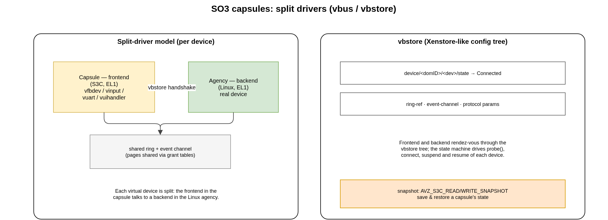

.. _capsules:

SO3 Capsules (SOO framework)
############################

An **SO3 Capsule** (acronym **S3C**) is a lightweight, self-contained guest that
runs at EL1 on top of the :ref:`AVZ hypervisor <avz>`. A capsule does not own any
hardware; it cooperates with an **agency** domain that owns the devices, through
split (frontend/backend) drivers.

.. note::

   *SO3 Capsule* / *S3C* is the current name and acronym for the concept that
   older code and papers called a *Mobile Entity* (ME). The source tree now uses
   the **S3C** acronym in identifiers (``S3C_desc_t``, ``S3C_state_t``,
   ``S3C_domID``, ``MAX_S3C_DOMAINS`` …) and *capsule* in prose. The legacy
   ``ME`` spelling no longer appears in the code.

The agency is a separate repository
===================================

The capsule model needs a **Linux** agency: Linux provides the backend drivers
and the higher-level services that capsules talk to. For the time being **the
Linux agency is not part of this (so3) repository** — it lives, together with the
rest of the **SOO framework**, in the separate
`soo repository <https://gitlab.com/smartobject/soo>`__ (also mirrored on
GitHub).

What *is* in this so3 repository is the **capsule (guest) side** and the
hypervisor support for it:

* the **frontend** drivers (``soo/drivers/``);
* the **vbus / vbstore** clients and the event-channel / grant-table glue
  (``soo/kernel/``);
* the hypervisor-side capsule **build / inject / snapshot** code
  (``so3/avz/`` — ``capsule_build.c``, ``injector.c``).

A capsule-capable guest is produced by ``virt64_capsule_defconfig`` (enabling
``CONFIG_SOO``). The AVZ demonstration shipped in this repository
(``virt64_avz_so3.its``) boots an **SO3** agency, which is enough to exercise the
hypervisor; running actual capsules additionally requires the Linux agency from
the soo repository.

Split (frontend/backend) drivers
=================================

Every virtual device a capsule uses is a **split driver**: a **frontend** in the
capsule talks to a **backend** in the Linux agency through a shared memory ring
and an event channel (set up with grant tables and :ref:`event channels <avz>`).

   Split drivers and the vbstore configuration tree.

The frontends shipped in ``soo/drivers/`` are:

.. flat-table::
   :header-rows: 1
   :widths: 30 70

   * - Frontend
     - Purpose
   * - ``vfbdevfront``
     - virtual framebuffer (display output for the capsule)
   * - ``vinputfront``
     - virtual input (keyboard / mouse events)
   * - ``vuartfront``
     - virtual serial console
   * - ``vuihandlerfront``
     - UI handler / application channel
   * - ``vlogsfront``
     - logging service
   * - ``vsenseledfront`` / ``vsensejfront``
     - Raspberry Pi Sense HAT LED matrix and joystick
   * - ``vdummyfront``
     - reference/test driver

All frontends share the common machinery in ``soo/drivers/vdevfront.c`` and
register through ``vbus`` as ``vbus_driver``\ s.

vbus and vbstore
================

The frontend and backend find and configure each other through two Xen-inspired
mechanisms:

vbstore
   A small, hierarchical **configuration store** (``soo/kernel/vbstore/``),
   analogous to Xenstore. Devices advertise their state and parameters at paths
   such as ``device/<domID>/<dev>/state``, ``…/ring-ref`` and
   ``…/event-channel``.

vbus
   The **virtual bus** (``soo/kernel/vbus/``) that enumerates devices and drives
   their state machine. When a frontend and its backend have both published their
   ring reference and event channel in vbstore and reached the *Connected* state,
   I/O can flow. The same state machine drives *probe*, *suspend* and *resume*.

Capsule state and the snapshot mechanism
========================================

A capsule's state is tracked by ``S3C_state_t``
(``soo/include/soo/uapi/soo.h``): ``S3C_state_stopped``, ``S3C_state_living``,
``S3C_state_suspended``, ``S3C_state_resuming``, ``S3C_state_awakened``,
``S3C_state_killed``, ``S3C_state_terminated``, ``S3C_state_dead`` (and the
``S3C_state_hibernate`` / ``S3C_state_booting`` intermediates).

AVZ provides a low-level **snapshot** primitive — ``AVZ_S3C_READ_SNAPSHOT`` and
``AVZ_S3C_WRITE_SNAPSHOT`` — that saves and restores a capsule's memory image and
its vbstore state. This is the building block the SOO framework uses to move a
capsule's execution state; the higher-level orchestration that drives it lives in
the soo repository, not here.
