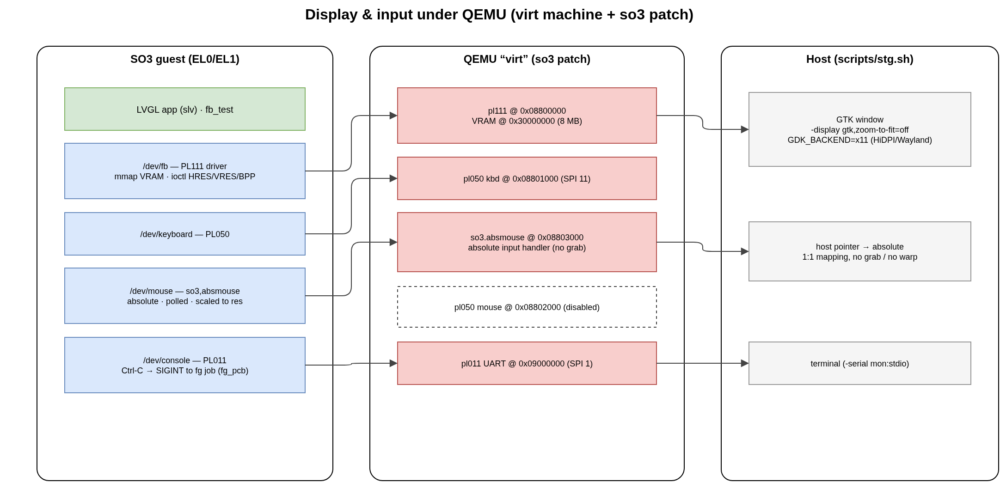

.. _display_input:

Display & Input (QEMU virt)
###########################

On the QEMU ``virt`` machine SO3 drives a small set of ARM PrimeCell devices for
graphics and human input. These are **not** part of the upstream ``virt`` model;
they are added by the SO3 QEMU patch
(``build/meta-qemu/.../files/0001-qemu-8.2.2-r0/0001-virt.c.patch``) and described
to the kernel in the device tree (``so3/dts/virt64.dts`` / ``virt32.dts``).

   The display and input path: SO3 ``/dev`` nodes ↔ the QEMU ``virt`` devices ↔
   the host GTK window.

.. flat-table::
   :header-rows: 1
   :widths: 22 18 12 14 34

   * - Device
     - MMIO base
     - IRQ
     - ``/dev`` node
     - Role
   * - PL111 CLCD
     - ``0x08800000``
     - —
     - ``/dev/fb``
     - framebuffer (1024×768, 32 bpp)
   * - PL050 KMI0
     - ``0x08801000``
     - SPI 11
     - ``/dev/keyboard``
     - PS/2 keyboard
   * - ``so3,absmouse``
     - ``0x08803000``
     - —
     - ``/dev/mouse``
     - **absolute** pointer (polled)
   * - PL050 KMI1
     - ``0x08802000``
     - SPI 12
     - —
     - PS/2 relative mouse (*disabled*)
   * - PL011 UART
     - ``0x09000000``
     - SPI 1
     - console
     - serial console + Ctrl-C

Framebuffer (PL111)
===================

The graphical output is an ARM **PL111 Color LCD Controller**
(``devices/fb/pl111.c``, ``compatible = "arm,pl111"``). The driver programs a
fixed **1024×768, 32 bpp** mode and points the controller at an **8 MB VRAM**
region the QEMU patch maps at guest-physical ``0x30000000``.

User space reaches the framebuffer through ``/dev/fb``:

.. code-block:: c

   int fd = open("/dev/fb", 0);

   uint32_t hres, vres, size, bpp;
   ioctl(fd, IOCTL_FB_HRES, &hres);   /* 1 -> 1024            */
   ioctl(fd, IOCTL_FB_VRES, &vres);   /* 2 -> 768             */
   ioctl(fd, IOCTL_FB_SIZE, &size);   /* 3 -> bytes           */
   ioctl(fd, IOCTL_FB_BPP,  &bpp);    /* 5 -> 32              */
   /* IOCTL_FB_IS_REAL == 4: is the framebuffer mmap-able?    */

   uint32_t *fb = mmap(NULL, size, 0, 0, fd, 0);   /* 0x00RRGGBB pixels */

The mapping is **non-cacheable**: the CPU writes must reach VRAM immediately so
that QEMU's dirty-page tracking refreshes the window. ``usr/src/fb_test.c`` is a
minimal, LVGL-free example that draws colour bars and a moving square straight
into ``/dev/fb`` — handy for checking the display path in isolation.

.. note::

   ``virtfb.c`` is a *fake* framebuffer (no ``mmap``, ``IOCTL_FB_IS_REAL`` = 0)
   used only by special configurations; the real graphical path is the PL111.

Keyboard (PL050)
================

The keyboard is an ARM **PL050 KMI** PS/2 interface (``devices/input/kmi0.c`` +
``ps2.c``, ``compatible = "arm,pl050,keyboard"``), IRQ-driven on **SPI 11** and
exposed as ``/dev/keyboard``. Key codes are read with the ``GET_KEY`` ioctl.

.. note::

   QEMU routes PL050 events only to the **focused** GTK window. The LVGL keypad
   indev also needs an ``lv_group`` of focusable widgets to do anything useful;
   the pointer (below) needs no group.

The absolute pointer (``so3,absmouse``)
=======================================

The historical mouse is a PL050 PS/2 device, which is **relative**: it reports
deltas, not positions. Under QEMU that forces *pointer-grab / warp* mode, which
is fragile — it breaks under Wayland (the compositor forbids pointer warping) and
the guest cursor drifts away from the host cursor, differently per monitor and
per HiDPI scale factor. No host-side tweak fully fixes a relative pointer.

SO3 therefore uses an **absolute** pointer, ``so3,absmouse``. It is a tiny
read-only MMIO device added by the QEMU patch at ``0x08803000``:

.. flat-table::
   :header-rows: 1
   :widths: 18 18 64

   * - Offset
     - Register
     - Meaning
   * - ``0x00``
     - ``X``
     - absolute X, ``0 … INPUT_EVENT_ABS_MAX`` (32767)
   * - ``0x04``
     - ``Y``
     - absolute Y, ``0 … INPUT_EVENT_ABS_MAX``
   * - ``0x08``
     - ``BTN``
     - buttons — bit 0 left, bit 1 right, bit 2 middle
   * - ``0x0c``
     - ``MAX``
     - ``INPUT_EVENT_ABS_MAX`` (scale reference)

On the **QEMU** side the device registers an *absolute* input handler
(``INPUT_EVENT_MASK_ABS | INPUT_EVENT_MASK_BTN``) and **activates** it. Registering
an absolute handler switches QEMU into absolute-pointer mode: there is no grab and
no warp, and the host pointer maps 1:1 onto the guest. Activation moves the handler
to the head of the list so that *button* events reach it rather than the still-present
(but unused) relative PL050 mouse — ``qemu_input_find_handler()`` returns the first
handler whose mask matches the event.

On the **guest** side ``devices/input/absmouse.c`` registers ``DEV_CLASS_MOUSE``
(i.e. ``/dev/mouse``). It carries **no IRQ**: the LVGL/``slv`` read callback polls
it once per refresh through the ``GET_STATE`` ioctl, and the driver scales the raw
``0 … MAX`` coordinates to the display resolution (set via ``SET_SIZE``). The
relative PL050 mouse (``kmi1.c``) is kept in the tree but its dts node is
``status = "disabled"`` so there is a single ``/dev/mouse``.

The host GTK window (``stg.sh``)
================================

The graphical launcher ``scripts/stg.sh`` starts QEMU with the **GTK** display
backend (``-display gtk,zoom-to-fit=off``):

* **GTK, not SDL** — the SDL backend does not present the PL111 console surface
  (the window stays black even though the framebuffer is rendered correctly);
  GTK shows it, and its *View* menu lists every console.
* **XWayland for HiDPI** — ``stg.sh`` exports ``GDK_BACKEND=x11`` (plus
  ``GDK_SCALE=1``). On a fractionally-scaled HiDPI **Wayland** panel, GTK reports
  pointer coordinates in a different scale than the framebuffer surface, so the
  absolute mapping comes out *offset* (host and guest cursors shifted) — fine on a
  1× external monitor, wrong on the laptop panel. Routing GTK through XWayland
  gives a uniform pointer-to-surface mapping, so the cursors coincide on every
  monitor. It is harmless on a native X11 session.

``scripts/st.sh`` is the headless sibling (``-display none``): no window, console
only, used for non-graphical work and CI.

.. _console_sigint:

Console Ctrl-C (SIGINT)
=======================

The serial console is the PL011 UART (``devices/serial/pl011.c``). Its interrupt
handler turns a typed **Ctrl-C** (``0x03``) into one of two actions, depending on
whether a thread is currently reading the console (tested via the ``read_lock``
mutex):

* **A shell is at its prompt** (a console read is in progress). The handler sets
  ``serial_intr``; ``pl011_get_byte()`` returns ETX and the line editor cancels the
  current line and reprints the prompt — the shell is *not* killed.
* **A foreground application is running** (no console read in progress). The
  handler delivers ``SIGINT`` to the foreground job. The target is the global
  ``fg_pcb``, maintained by ``sys_do_wait4()`` in ``kernel/process.c``: when the
  shell blocks waiting on a child it sets ``fg_pcb = child``, and restores it to
  itself when the child exits. (Using ``fg_pcb`` rather than ``current()`` matters
  because, in IRQ context, ``current()`` is usually the idle thread — the
  foreground app is asleep.)

Terminating a **multi-threaded** application correctly (an LVGL app runs an
``slv`` tick *pthread* alongside its main loop) takes coordinated teardown:

* ``ipc/signal.c`` (``sig_check``) **defers** a fatal default-action signal
  (SIGINT/SIGTERM/SIGKILL) to the process *main thread*. Otherwise a spawned
  thread — which wakes far more often — would call ``exit_group()`` and zombie only
  itself, leaving the main thread alive.
* ``kernel/thread.c`` (``discard_tcb_in_pcb``) cooperatively cancels the spawned
  threads: each is flagged ``killed`` and woken, and self-terminates at its next
  blocking point; the last one signals ``threads_active`` so the main thread's wait
  completes.
* ``kernel/schedule.c`` (``next_thread``, the round-robin policy) still schedules a
  thread whose pcb is already ``ZOMBIE`` *if* it is ``killed`` or it is the pcb's
  ``main_thread`` — these run kernel-only teardown code and never return to user
  space, so they must get the CPU to finish exiting.

See :ref:`kernel` for the broader process/thread model.
