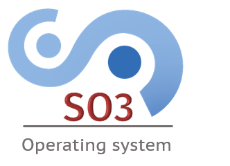

.. doc Documentation master file.

.. toctree::
   :maxdepth: 4
   :numbered:
   :hidden:
  
   user_guide
   so3_jtag_rpi4
   lvgl
   lwip
   
============================================
Smart Object Oriented (SO3) Operating System
============================================

For any information and discussions related to SO3, please
visit our main discussion forum at https://discourse.heig-vd.ch/c/so3/6

Setup and Environment
=====================

-  :ref:`User Guide <user_guide>`
-  :ref:`Debugging with JTAG on Raspberry Pi 4 <so3_jtag_rpi4>`

  
Development flow
================

The master contains the last released version of the SO3 operating system.

-  It is not allowed to push directly to the master. If you want to
   contribute, please create a new issue and we will create a dedicated
   branch in which you can develop as you want. A merge request will
   then be processed to validate and merge your contributions.

Discussion forum
================

A `dedicated discussion forum <https://discourse.heig-vd.ch/c/so3/10>`__
is available for all questions/remarks/suggestions related to SO3.
Do not hesitate to create topics and to contribute.
     

