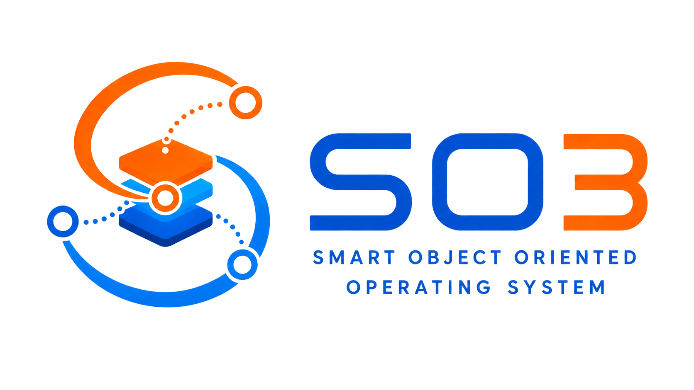
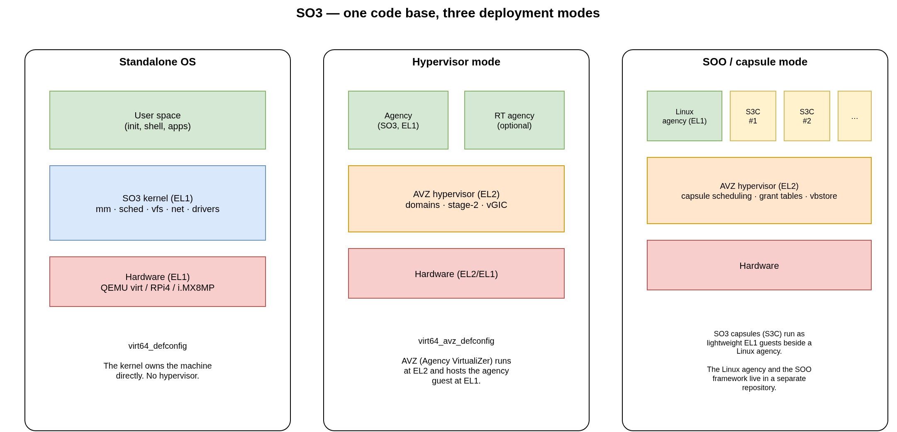

.. doc Documentation master file.

.. toctree::
   :maxdepth: 2
   :numbered:
   :hidden:
   :caption: Concepts & architecture

   introduction
   architecture
   kernel
   avz
   capsules

.. toctree::
   :maxdepth: 2
   :numbered:
   :hidden:
   :caption: Building & running

   build_system
   user_guide
   user_space
   display_input
   debugging
   so3_jtag_rpi4

.. toctree::
   :maxdepth: 2
   :numbered:
   :hidden:
   :caption: Integrations & conventions

   lvgl
   lwip
   micropython
   Coding conventions <coding_conventions>

============================================
Smart Object Oriented (SO3) Operating System
============================================

SO3 is a compact, lightweight, full-featured and extensible operating system,
particularly well suited to embedded systems. From a single code base it can be
built in three ways:

* as a **standalone OS** running directly on the hardware (EL1 on ARM64);
* as the **AVZ hypervisor** (*Agency VirtualiZer*) running at EL2 and hosting a
  guest *agency* domain;
* as an **SO3 capsule** (S3C) — a lightweight guest running on top of AVZ beside
  a Linux *agency*, as part of the **SOO** framework.

   The same SO3 code base deployed in its three modes.

This documentation reflects the current state of the code base: ARM 32/64-bit,
multicore, the AVZ hypervisor and SO3 capsules are all supported.

Where to start
==============

:ref:`Introduction <introduction>`
    Philosophy, history and the polymorphic nature of SO3.

:ref:`Architecture <architecture>` · :ref:`Kernel internals <kernel>`
    The user/kernel split, the boot flow, and how the kernel subsystems work.

:ref:`AVZ hypervisor <avz>` · :ref:`SO3 capsules <capsules>`
    Virtualization at EL2 and the SOO capsule framework.

:ref:`Build system <build_system>` · :ref:`User guide <user_guide>`
    How the tree is built, configured and packaged, and a step-by-step setup.

:ref:`User space <user_space>` · :ref:`Debugging <debugging>`
    The MUSL-based user land, and how to debug SO3 under QEMU/GDB or JTAG.

Development flow
================

The ``main`` branch contains the last released version.

.. important::

   Do not push directly to ``main``. Each development leads to an issue with its
   own branch; open a merge/pull request as soon as it is stable enough for
   review.

If you want to contribute, please first contact `the maintainer <SOO_mail_>`__.

Discussion forum
================

A `dedicated discussion forum <https://discourse.heig-vd.ch/c/so3>`__ is
available for all questions, remarks and suggestions related to SO3.

We would like to thank our sponsors for their generous support in funding the
development of the SO3 ecosystem, especially `HEIG-VD <http://www.heig-vd.ch>`__
and the `Hasler Foundation <https://haslerstiftung.ch/en/welcome-to-the-hasler-foundation>`__.

.. _SOO_mail: info@soo.tech
