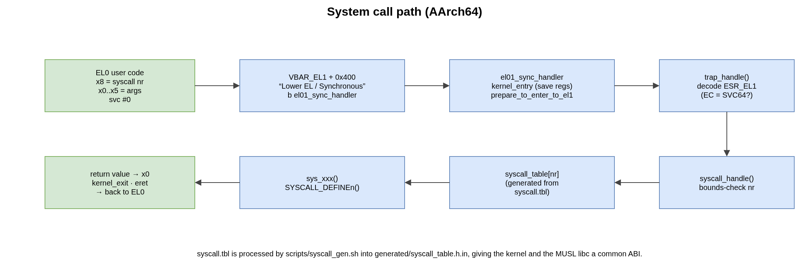
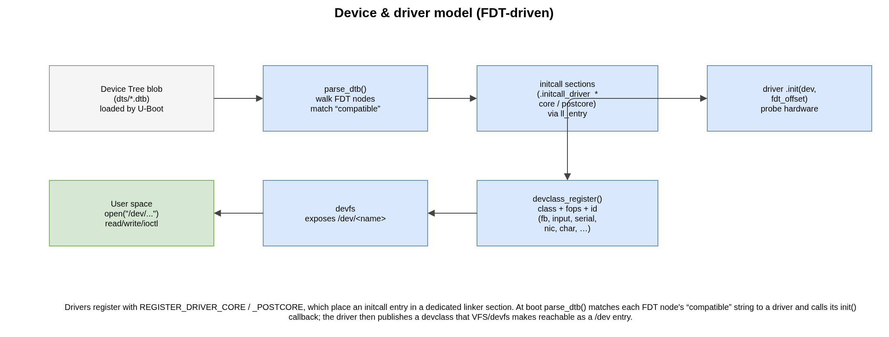

.. _kernel:

Kernel Internals
################

This chapter describes the main subsystems of the SO3 kernel as they exist in
the source tree. Unless stated otherwise the discussion targets the ARM64
(``arch/arm64``) port; the ARM32 port follows the same structure with 2-level
page tables and the classic AArch32 register model.

Memory management
=================

Page-frame allocator
--------------------

Physical memory is tracked by a **frame table** (``mm/memory.c``): an array with
one entry per physical page, recording whether the page is free and its
reference count. The amount of RAM and its base address are obtained from the
device tree at boot (``get_mem_info()``). ``get_free_page()`` returns a free
physical page (the table is protected by a spinlock); pages are released back to
the table when their reference count drops to zero.

Kernel heap
-----------

Dynamic kernel allocations use a **quick-fit** heap (``mm/heap.c``) sized by
``CONFIG_HEAP_SIZE_MB`` and reserved by the linker script. ``malloc()`` /
``free()`` operate on this heap; chunks carry small metadata headers and are
kept on free lists by size.

MMU and address translation
---------------------------

The page tables are built in ``arch/arm64/mmu.c``. On ARM64 SO3 uses up to
**four levels** (L0–L3) with 4 KiB granularity; the presence of the top L0 level
depends on ``CONFIG_VA_BITS_48``. ``create_mapping()`` installs a virtual→
physical mapping in a given page table, allocating intermediate tables as needed
and choosing block (1 GiB / 2 MiB) or page (4 KiB) descriptors according to
alignment and size. The kernel runs from the high half (``TTBR1_EL1``); each
process has its own low-half table (``TTBR0_EL1``). See
:ref:`the address-space section <architecture>` for the layout and the
``CONFIG_KERNEL_VADDR`` values.

Threads and scheduling
======================

The unit of execution is a **thread**, described by a *Task Control Block*
(``tcb_t``, ``include/thread.h``): thread id, priority, state
(``READY`` / ``RUNNING`` / ``WAITING`` / ``ZOMBIE`` …), a saved CPU context
(``cpu_regs_t``) and a stack slot. Threads are either **kernel threads**
(``kernel_thread()``) or **user threads** (``user_thread()``) attached to a
process.

The scheduler lives in ``kernel/schedule.c``. The default policy is
**round-robin** (``CONFIG_SCHED_RR``) with timer-driven preemption
(``CONFIG_SCHED_FREQ_PREEMPTION``); a fixed-priority policy
(``CONFIG_SCHED_PRIO``) is also available. ``schedule()`` selects the next
runnable thread and calls ``__switch_to()`` (``arch/arm64/context.S``), which
saves the callee-saved registers (x19–x29, ``sp``, ``lr``) of the outgoing
thread into its TCB and restores them from the incoming one.

Processes
=========

A **process** (``pcb_t``, ``include/process.h``) owns an address space
(its L0 page table), a heap, a set of file descriptors and one or more threads.
Processes are created by the usual ``fork()`` / ``execve()`` pair.

The very first process is built by ``create_root_process()``
(``kernel/process.c``). It maps the compiled-in ``.root_proc.text`` trampoline
(``__root_proc`` in ``arch/arm64/context.S``) at ``USER_SPACE_VADDR``
(``0x1000``) and starts a user thread there. The trampoline immediately issues
an ``execve("init.elf")`` so that the first *real* program is the init process.

ELF binaries are parsed and loaded by ``fs/elf.c`` (``elf_load_buffer()`` reads
the file through the VFS; the loadable segments are then mapped into the
process' address space).

System calls
============

User code enters the kernel with the ``svc`` instruction. The system-call number
is passed in **x8** and the arguments in **x0–x5** (AArch64 ABI).

   The AArch64 system-call path.

The ``svc`` traps to the *Lower EL / Synchronous* slot of the EL1 vector table
(``VBAR_EL1 + 0x400``, ``arch/arm64/exception.S``), which branches to
``el01_sync_handler``. That handler saves the user context and calls
``trap_handle()`` (``arch/arm64/traps.c``), which decodes ``ESR_EL1``; for an
``SVC64`` exception it forwards to ``syscall_handle()`` (``kernel/syscalls.c``).

The dispatch table ``syscall_table[]`` is **generated at build time** from
``syscall.tbl`` by ``scripts/syscall_gen.sh`` (producing
``generated/syscall_table.h.in``), giving the kernel and the MUSL libc a common
ABI. Each entry is a ``sys_xxx()`` function declared with the
``SYSCALL_DEFINEn()`` macros. The return value is placed back in ``x0`` and the
handler ``eret``\ s to EL0.

.. warning::

   The vector table must contain **all 16** architectural slots, correctly
   spaced. Omitting a slot (for instance behind a bare ``#ifdef CONFIG_AVZ``)
   shifts the lower-EL vectors and silently misroutes ``svc`` to the wrong
   handler — see the SError slot in ``arch/arm64/exception.S``.

Inter-process communication
===========================

The ``ipc/`` directory provides:

* **signals** (``signal.c``) — POSIX-like signals checked on return to user
  space; ``rt_sigaction()``, ``kill()``, signal masks, default actions;
* **pipes** (``pipe.c``) — in-kernel FIFOs with blocking read/write backed by
  completions;
* **semaphores** (``semaphore.c``) and **completions** (``completion.c``) — the
  kernel's synchronisation primitives, also used internally by drivers and the
  scheduler.

Virtual filesystem
==================

The **VFS** (``fs/vfs.c``) maintains a global file-descriptor table; each
process maps its local descriptors (``pcb->fd_array``) onto global ones. File
operations are dispatched to the filesystem that owns the file. The kernel
registers:

* **FAT** (``fs/fat/``) — a FAT driver used for the root filesystem, whether it
  is a RAM disk (``CONFIG_ROOTFS_RAMDEV``) packed in the FIT image, or an MMC
  card (``CONFIG_ROOTFS_MMC``);
* **devfs** (``fs/devfs/``) — a virtual filesystem that exposes registered
  devices under ``/dev``.

``vfs_init()`` is called early in ``kernel_start()`` and sets up these
filesystems before the root process is launched.

Device and driver model
========================

SO3 uses a **device-tree-driven** driver model.

   From the device tree to a ``/dev`` entry.

Drivers register with the ``REGISTER_DRIVER_CORE`` / ``REGISTER_DRIVER_POSTCORE``
macros, which place an *initcall* entry into a dedicated linker section
(``.initcall_driver_initcall_t_core`` / ``…_postcore`` in the linker script,
reached at runtime through the ``ll_entry_*`` helpers). At boot,
``parse_dtb()`` (``devices/``) walks the flattened device tree, matches each
node's ``compatible`` string against the registered drivers and calls the
driver's ``init(dev, fdt_offset)`` callback. A driver then publishes a
**device class** (``devclass``) with its file operations and a device-id range;
``devfs`` makes it reachable as ``/dev/<name>``.

The tree contains drivers for the main device classes:

.. flat-table::
   :header-rows: 1
   :widths: 25 75

   * - Class (``devices/``)
     - Drivers
   * - interrupt controller (``irq/``)
     - ARM GIC (v2/v3), and the virtual GIC for AVZ (see :ref:`avz`)
   * - timer (``timer/``)
     - ARM generic timer (``arm_timer``)
   * - serial (``serial/``)
     - PL011, NS16550, i.MX UART
   * - storage (``mmc/``, ``ramdev/``)
     - SD/MMC controller, in-memory RAM disk
   * - framebuffer (``fb/``)
     - PL111, ramfb, virtio-fb (used by LVGL)
   * - input (``input/``)
     - PS/2 (PL050), virtio input
   * - network (``net/``)
     - virtio-net / smc911x, wired to lwIP
   * - i2c, rpisense (``i2c/``, ``rpisense/``)
     - I²C bus and Raspberry Pi Sense HAT

Interrupts and time
===================

The exception vectors are installed at ``VBAR_EL1`` (``arch/arm64/exception.S``).
Hardware interrupts are handled by the **GIC** driver (``devices/irq/gic.c``):
on an IRQ the handler reads the interrupt acknowledge register, dispatches to the
registered handler and signals end-of-interrupt. In the standalone (EL1)
configuration the CPU interface uses ``EOImode = 0`` (a single ``EOIR`` write
both drops priority and deactivates the interrupt). The AVZ (EL2) configuration
uses ``EOImode = 1`` and the virtual GIC to forward interrupts to guests — see
:ref:`avz`.

Time is provided by the ARM generic timer (``devices/timer/arm_timer.c``). A
periodic tick drives the scheduler; ``calibrate_delay()`` (run once during
bring-up) waits for the first ticks to compute the busy-loop delay constant.

Networking
==========

SO3 integrates the **lwIP** TCP/IP stack (``net/lwip/``). The kernel exposes a
BSD-style socket API; the ``net/`` glue maps VFS file descriptors onto lwIP
sockets so that ``socket()`` / ``bind()`` / ``connect()`` / ``send()`` /
``recv()`` work from user space. TCP, UDP, IPv4/IPv6 and a DNS resolver are
available; the underlying NIC is a virtio-net (QEMU) or smc911x (hardware)
driver. See :ref:`lwip`.
