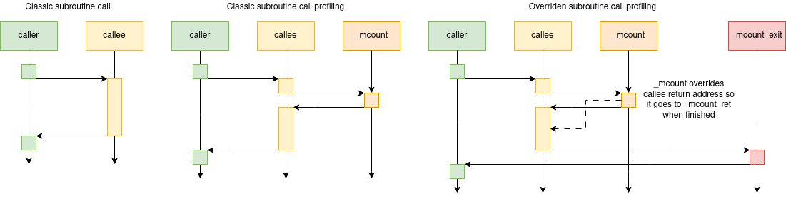
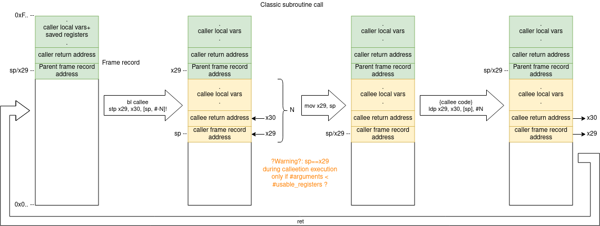
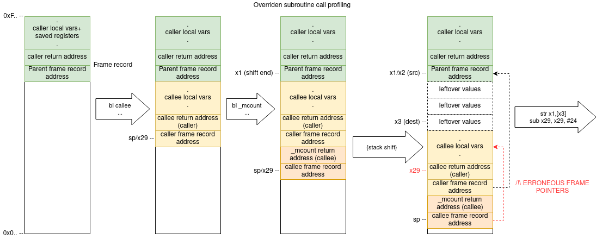

LVGL - Light and Versatile Embedded Graphics Library
====================================================

LVGL is a free and open-source library providing an efficient GUI for embedded systems.
More information is available on the `official site <https://lvgl.io/>`__.

Integration of LVGL in SO3
--------------------------

The major work of porting LVGL in SO3 has been done by Nikolaos Garanis in the context of 
his `Bachelor project <https://nyg.gitlab.io/so3-support-graphique>`_.

Some details about the porting can be found in our `discussion forum <https://discourse.heig-vd.ch/t/graphics-support-for-so3/41/18>`__.

There is `a small video <LVGL_qemu_>`__ to show LVGL running in the QEMU/vExpress framebuffer emulated environment.

In addition, from LVGL v8, the ``lv_demo_widgets`` is now fully supported. And yes, SO3 integrates LVGL v8.

This part will be completed very soon...

.. _LVGL_qemu: https://youtu.be/skn_mp3ZBhI

Using LVGL in the emulated environment
--------------------------------------

.. note::

   First, make sure you compiled the kernel with a configuration
   which has the framebuffer enabled (for example, *vexpress_fb_defconfig*)
   
In order to have a graphical framebuffer in the emulated QEMU/vExpress 
environment, it is necessary to start the emulator with the ``stg`` script:

.. code-block:: bash

   ./stg
   
QEMU will start a new GUI window used as framebuffer.

LVGL Performance Test
---------------------

SO3 is used to check the performance of LVGL. This workflow behaves as shown in this diagram:

.. image:: LvglCheckPerfAction.png
	
The actions are described below

#. Retrieve the LVGL commit that triggered the action and store it in a "lvgl_base" folder for the dockerfile to use
#. Retrieve "Dockerfile.lvgl" from the SO3 repository and build the docker image
#. Run the docker image to generate the performance data (function execution times)
#. Store the performance data as an artifact for future reference
#. Find previous successful action run and recover the performance data from it
#. Process the performance data and compare it to previous executions and set thresholds to detect performance issues
#. Create an artifact in the form of a log file that shows the output of the regression test

The image is ran using two volumes: One that redirects the container's "/host" folder to the workflow's working directory and one that allows the container to access the workflow's devices (in the /dev folder) as his own

The workflow is setup to run when
* Commits are pushed to LVGL's repo 
* A pull request is created 
* Launched from another workflow

Dockerfile
^^^^^^^^^^^^^^^^^^^^^^^^^^^^

LVGL's check_perf workflow uses the Dockerfile.lvgl found at the root of this repository to create the image that runs SO3 on qemu and executes the tests. The dockerfile does the following:

#. Creates an Alpine image and installs all the necessary tools (like gcc and qemu)
#. Recovers SO3's main branch in the root ("/") folder 
#. Empties the "*/so3/usr/lib/lvgl*" folder and replaces its content with the LVGL repo to be tested (The LVGL code should be in a "lvgl_base" folder)
#. Patches SO3 so it executes the *prof_test* application instead of the shell at launch
#. Builds U-boot and the SO3 kernel
#. Imports the *prof_test* (*test/perf* folder from LVGL) application into SO3's userspace and builds the userspace
#. Sets up the image so it exposes the port 1234 when ran and executes "./st"

Custom subroutine call profiling
^^^^^^^^^^^^^^^^^^^^^^^^^^^^^^^^^

LVGL's check_perf workflow relies on a custom implementation of the *_mcount* function implemented in SO3's libc. This function is called at the start of each function found in a source file when this source file is built with GCC's "-p" (profiling) flag. The custom implementation modifies the stack to insert another function (*_mcount_exit*) as return function of the profiled function (the one that called *_mcount*). Both *_mcount* and *_mcount_exit* call a C function that timestamps their execution with the return address of the profiled function. This allows a custom script to analyse the executable file to find the function that was timestamped and calculate its execution time. This approach allows some code to be profiled automatically without the need to explicitely call timestamping functions from within the code.

Subroutine calls sequence diagram

On profiled subroutine calls, _mcount is called right after the prolog of the callee function but not at the end of it, preventing its use for actual execution time calculations. _mcount is thus modified to override the return address of the callee function and have it return to _mcount_exit before going back to caller

Subroutine calls stack diagram

This diagram shows the stack's evolution during a classic subroutine call (with Aarch64)

Those diagrams show the way the stack is shifted and filled by _mcount to insert _mcount_exit as the parent of the callee function

